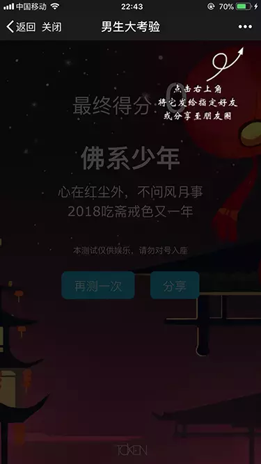
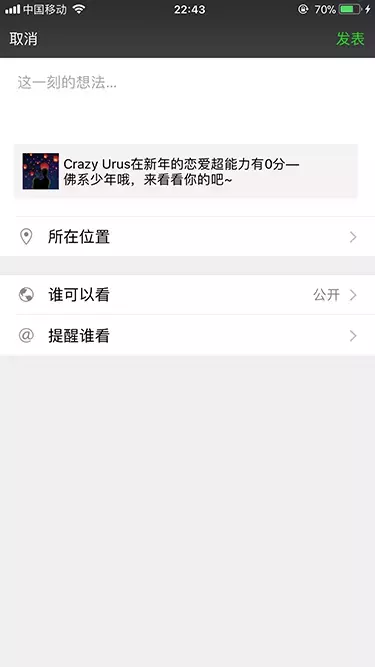
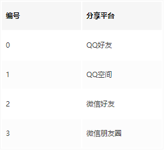
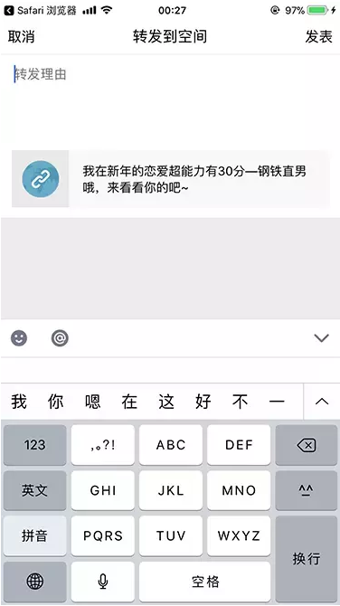

## 微信分享

微信下的分享通过调用微信提供的JS-SDK和引导用户点击右上角完成。
使用微信的JS-SDK需要引入如下js文件：

```html
<script src="//res.wx.qq.com/open/js/jweixin-1.3.2.js"></script>
```

设置分享内容的代码如下：

```js
  wx.config({
      debug: false,
      appId: '公众号的appid',
      timestamp: '时间戳',
      nonceStr: '随机字符串',
      signature: '签名',
      jsApiList: ['onMenuShareTimeline', 'onMenuShareAppMessage', 'onMenuShareQQ', 'onMenuShareWeibo', 'onMenuShareQZone', 'showOptionMenu', 'hideAllNonBaseMenuItem', 'showAllNonBaseMenuItem']
  });
  
  wx.ready(function() {
      const share = {
          title: '分享标题（朋友圈只显示标题）',
          desc: '分享内容',
          imgUrl: '图片URL',
          link: '分享链接（最好是后台JS安全域名）',
          success: function() {
              hideMaskLayer();  // 分享成功，隐藏引导用户分享的浮层
          },
          cancel: function() {
          }
      };
      wx.onMenuShareAppMessage(share);  // 微信好友
      wx.onMenuShareTimeline(share);  // 朋友圈
      wx.onMenuShareQQ(share);  // QQ
      wx.onMenuShareQZone(share);  // QQ空间
      wx.onMenuShareWeibo(share);  // 腾讯微博
  });
```

注释：其中wx.config中的参数由服务端得到，具体可参见微信的开发文档：https://link.juejin.im/?target=https%3A%2F%2Flink.jianshu.com%3Ft%3Dhttps%253A%252F%252Fmp.weixin.qq.com%252Fwiki%253Ft%253Dresource%252Fres_main%2526id%253Dmp1421141115

注意在公众号后台设置JS安全域名，效果如下：

<p>
  
</p>
引导用户分享

<p>
  
</p>
分享到朋友圈（自定义文案）


## QQ/TIM的分享

1、通过JS API分享

QQ（以下无特殊说明TIM下同样有效）下也有设置分享内容的API，同样需要先引用JSBridge相关的文件：
```html
<script src="//open.mobile.qq.com/sdk/qqapi.js"></script>
```

设置分享内容的代码如下：

```js
  const share = {
      title: '分享标题，最大45字节',
      desc: '分享内容，最大60字节',
      image_url: '图片URL',
      share_url: '分享链接'
  };
  mqq.data.setShareInfo(share, callback);
```
需要注意的是：分享链接长度不能超过120字节，并且必须跟页面URL同一个域名，否则设置不生效；分享的图片最小需要200 * 200，否则分享到QQ空间时会被过滤掉。
设置完分享内容后，可通过API调用唤起QQ的分享面板，免去引导的过程。

```js
mqq.ui.showShareMenu();
```

还有一种方法，QQ提供了监听点击分享平台的事件，当点击Native分享面板中的分享平台时，会触发此事件，QQ默认的分享行为将不再执行。代码如下：

```js
mqq.ui.setOnShareHandler(function (platform) {
    mqq.ui.shareMessage({
        title: '分享标题',
        desc: '分享内容',
        share_type: platform,
        share_url: '分享链接',
        image_url: '图片URL',
        sourceName: '掌上理工大',
        back: true
    }, function() {
    });
});
```

其中platform是分享平台类型，取值如下：
<p>
  
</p>

2、通过meta标签分享

QQ也支持通过设置meta标签定义分享内容。通过定义itemprop可设置分享内容，同时为了更好的兼容其它平台，我们也引入了Open Graph标准。代码如下：

```html
<meta itemprop="name" property="og:title" content="分享标题">
<meta property="og:url" content="分享链接">
<meta itemprop="image" property="og:image" content="图片URL">
<meta name="description" itemprop="description" property="og:description" content="分享描述">
```

需要注意的是，meta标签需要是服务端渲染输出，通过js生成或修改无效。

3、通过URL Scheme唤起QQ分享

还可以通过URL Scheme唤起QQ进行分享，该方法的好处在于可以在非QQ环境下唤起QQ实现分享，缺点在于不能设置分享图片。代码如下：

```js
const share = {
    title: '分享标题',
    desc: '分享内容',
    share_url: '分享链接'
};
const url_scheme = '//share/to_fri?src_type=web&version=1&file_type=news&share_id=1103437993&title=' + Base64.encode(share.title) + '&thirdAppDisplayName=5o6M5LiK55CG5bel5aSn&url=' + Base64.encode(share.share_url) + '&description=' + Base64.encode(share.desc);
location.assign('mqqapi:' + url_scheme);
setTimeout(function() {
  location.assign('timapi:' + url_scheme);
}, 2000);

```
其中分享的参数在拼入URL中时需要Base64编码。为了支持TIM下的分享，我们引入了延时函数，如果唤起QQ失败该定时器将会执行唤起TIM，唤起成功离开了此页面将不会执行。QQ和TIM均安装时优先唤起QQ。
效果如下：
<p>
  
</p>
唤起的Native分享

4、通过分享组件的URL实现

QQ空间提供了分享组件（可参见：connect.qq.com/intro/share），通过分析该组件可得到分享URL的参数。代码如下：

```js
const share = {
    title: '分享标题',
    desc: '分享内容',
    image_url: ['图片URL'],
    share_url: '分享链接'
};
let image_urls = share.image_url.map(function(image) {
    return encodeURIComponent(image);
});
location.replace('https://sns.qzone.qq.com/cgi-bin/qzshare/cgi_qzshare_onekey?url=' + encodeURIComponent(share.share_url) + '&site=掌上理工大&title=' + share.title + '&pics=' + image_urls.join('|') + '&summary=' + share.desc);

```
其中可支持多图片的分享，图片URL用竖线分隔。
该方法优点在于同样支持非QQ环境下的分享。非QQ下用户登录后即可分享，QQ下可免登直接分享。

效果如下：
<p>
  
</p>
QQ空间分享组件

## 微博的分享

